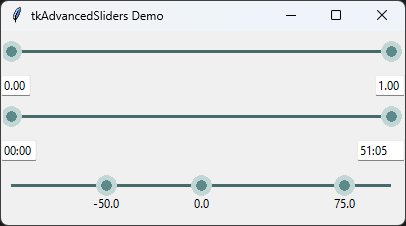

# tkAdvancedSliders

This package provides two main tkinter widgets:
- `RangeSlider` is a tkinter widget that features a two-headed range slider, useful for any situation that requires a user to mark approximate 'in' and 'out' points.
- `Slider` is a multi-point slider 

# Attributions
The original `RangeSlider` is an expansion of lgimberis's [`tkinter-range-slider`](https://github.com/lgimberis/tkinter-range-slider/tree/4a1337197edded6af5b11533f8683ffc42a3cd46), witch itself builds upon MenxLi's [`tkSliderWidget`](https://github.com/MenxLi/tkSliderWidget/tree/46b928b5c4ad96242196e7224897d5d74b66f592) `Slider` class.

