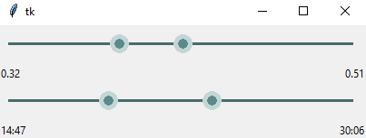

# RangeSlider

RangeSlider is a tkinter widget that features a two-headed range slider, useful for any situation that requires a user to mark approximate 'in' and 'out' points.
A demo (executed when running range_slider.py as main) is provided at the end of that file.

RangeSlider is an expansion of lgimberis's [`tkinter-range-slider`](https://github.com/lgimberis/tkinter-range-slider), witch itself builds upon MenxLi's [`tkSliderWidget`](https://github.com/MenxLi/tkSliderWidget)

